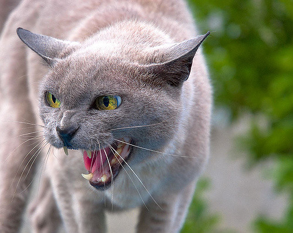

# IASC-2P02 | Andrea Chaves
## About me

MY name is Andrea Chaves, I am in Interactive Arts and Sciences here at Brock. I've played on the Brock varsity squash team for 4 years and am the #1 on the Woman's team. I have two jobs, one being a squash instructor at White Oaks whihc I love doing. I have a cat named Howie (not pictured below), he's a blue Russian cat and very emotionally unavailable. I have recently also joined badminton intermurals here at Brock with my best friend Py who is also my doubles partner. 

## Blog post

Lorem ipsum dolor sit amet... [continue reading](blog)
